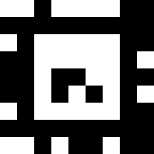
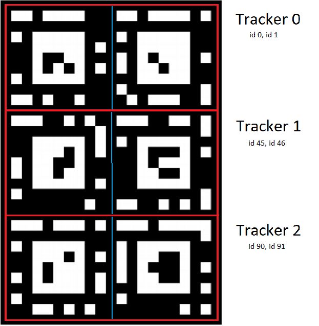
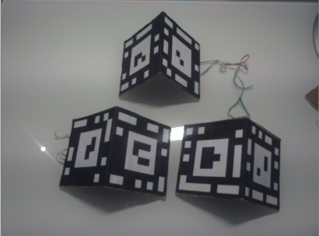
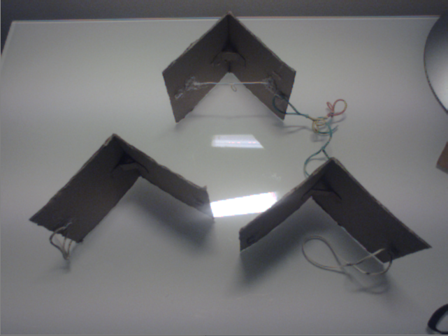
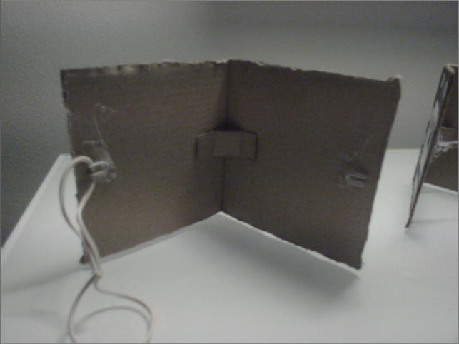
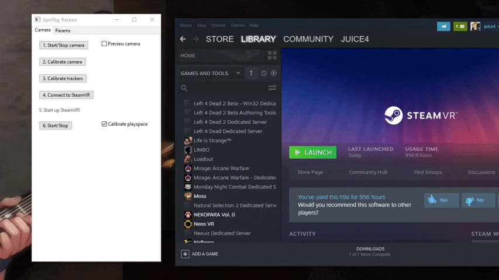
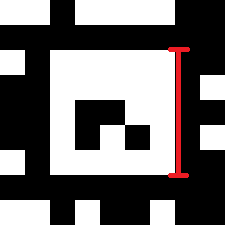

# April-Tag-VR-FullBody-Tracker
Full-body tracking in VR using AprilTag markers.

This is my second attempt at creating a full-body tracking system using fiducial markers. This should enable people to get fullbody tracking for free, using only a phone and some cardboard. It is possible to get pretty good tracking with trackers of sizes as small as 10cm and a PS eye camera of 640x480 resolution. Increasing the marker size or using a higher resolution and faster phone camera further improves tracking.

To use, you will have to make three trackers - one for each leg and one for hips. Using only leg trackers will not work in VRChat!

This version uses the much more accurate AprilTag system and includes many improvements to make the system easier to use, such as a GUI interface and a more straight forward calibration.

If you have any issues or encounter any bugs, feel free to open an issue on github or message me on discord: juice#6370

The program can be downloaded from the releases tab.


Beatsaber demo: https://youtu.be/Akps-dH0EeA


## Table of contents

- [Discord server](https://github.com/ju1ce/April-Tag-VR-FullBody-Tracker#we-now-have-a-discord-server)
- [Connecting a camera](https://github.com/ju1ce/April-Tag-VR-FullBody-Tracker#connecting-a-camera)
- [The trackers](https://github.com/ju1ce/April-Tag-VR-FullBody-Tracker#the-trackers)
- [Installing the SteamVR driver](https://github.com/ju1ce/April-Tag-VR-FullBody-Tracker#installing-the-steamvr-driver)
- [Running Apriltag Trackers](https://github.com/ju1ce/April-Tag-VR-FullBody-Tracker#running-apriltag-trackers)
    - [Camera tab](https://github.com/ju1ce/April-Tag-VR-FullBody-Tracker#camera-tab)
        - [Start/Stop camera](https://github.com/ju1ce/April-Tag-VR-FullBody-Tracker#startstop-camera)
        - [Calibrate camera](https://github.com/ju1ce/April-Tag-VR-FullBody-Tracker#calibrate-camera)
        - [Calibrate trackers](https://github.com/ju1ce/April-Tag-VR-FullBody-Tracker#calibrate-trackers)
        - [Connect to SteamVR](https://github.com/ju1ce/April-Tag-VR-FullBody-Tracker#connect-to-steamvr)
        - [Start](https://github.com/ju1ce/April-Tag-VR-FullBody-Tracker#start)
    - [Parameters](https://github.com/ju1ce/April-Tag-VR-FullBody-Tracker#parameters)
    - [Known issues](https://github.com/ju1ce/April-Tag-VR-FullBody-Tracker#known-issues)
    - [TODO](https://github.com/ju1ce/April-Tag-VR-FullBody-Tracker#todo)

## We now have a discord server!
https://discord.gg/g2ctkXB4bb

## Connecting a camera

The first step is connecting a camera feed to you computer. This step is probably the most complex, since you will have to find out what works best for you.
Each of the methods has its pros and cons, so try them out and see what works best. If you know of any other option, feel free to use that!

This tutorial only outlines the methods to connect a camera, and their pros and cons. If you have problems related to these, you should refer to their official tutorials. You should get it working before continuing with the tutorial.

### Using a USB webcam:

#### Pros:
* Simple to setup
* High quality cameras will offer good performance(1080p 60fps)

#### Cons:
* Most cameras have a too low resolution and too much motion blur to use effectively

If you have a USB camera, you should try that first. If tracking is too bad, you can always switch to a phone later. A ps3 eye camera will work, but just barely due to its low resolution.

#### Tutorial:

Connect the camera to your PC and you are done! If you use a PS3 eye camera, also install the PS3 eye universal driver.

### Using IP-Webcam wireless:

#### Pros:
* Fairly simple to setup
* Plenty of video options

#### Cons:
* Requires a good wifi connection
* Your PC and phone must be connected to the same network
* Only for android phones

If you have your PC and android phone connected to the same router and you have a strong wifi connection on your phone, this is the option you should use.

#### Tutorial:

Download the app IP Webcam from the play store. Start the app. Under video preferences->video resolution, select the resolution you wish to use. You should try to use a 4:3 aspect ratio with a resolution of around 800x600. Then, go back and click start server. Try to connect to your phone through your browser: click the help icon 
if you dont know how

### Using IP-Webcam wired:

#### Pros:
* Plenty of video options

#### Cons:
* A little harder to setup
* May not work on all phones and computers

If you dont have a good wifi connection, but have a half recent android phone, you should try this option. It may not work, however.

#### Tutorial:

For this we will use our phones network over USB feature. This is usualy used to share the phones network or wifi with a computer, but if we disable wifi and mobile network on our phone, we can also use it as a direct connection between our phone and PC. First disable wifi and mobile network. Then connect your phone to your PC with a USB cable. Now enable the internet over USB option on your phone. Now, you can follow the same instructions as for the wireless one!

NOTE: Make sure that your networks are disabled or this won't work!

### Using DroidCam OBS:

#### Pros:
* Should work on any device, including iphones
* Wired or wireless

#### Cons:
* Less video options than IP-Webcam
* Higher latency

If previous options dont work for you or you have an iphone, this is the option you should choose. It should work on any device, either wireless or wired.

#### Tutorial:

First, follow the DroidCam OBS official tutorial to get the phone-OBS connection. Use the 720p video resolution to ensure there is no watermark.
Then, follow the OBS VirtualCam plugin tutorial to stream to a virtual camera.
The phone will now act as a regular webcam.

## The trackers

### How the trackers work



This is a single Apriltag marker. Each marker has a white square in the middle that is used for detection and an unique pattern of black and white for identification. This means that a single marker must always be completely visible and completely flat in order to be detected.

A tracker is composed of multiple markers facing diffrent directions, which ensures that at least one marker is visible when rotating it. They must all be fixed together and none of the markers that are included in a tracker should move or bend seperately. Tracker 0 is composed of marker id 0 and any number of extra markers of ids 1-44, tracker 1 is marker id 45 and any number of markers 46-89 etc.

The simplest version of three trackers is the following: Tracker 0 made of marker 0 and 1, tracker 1 of marker 45 and 46 and tracker 3 of marker 90 and 91. To prevent bending, they are glued to cardboard. Each of them are glued together at an 90° angle. To make them yourselves, print the Apriltag.pdf file. Refer to the below photos to cut them out and glue them properly.



Cut along the red lines, bend along the blue lines. Print the image without the lines.



How the trackers should look like from the front



How the trackers should look like from the top



Close up of whats behind the leg trackers. Notice the small piece of cardboard for support against bending and the hooks for rubber bands.


Tracker 0 will be used on our hips, and, since the rubber bands will stretch it more, should use some additional supports. I used some wire, but you can rather just use more cardboard.

Add some way of fixing the trackers to your body. I use some hooks, through which i can then fix the trackers using rubber bands.

NOTE: Make sure the pattern on the trackers is clearly visible and is not obstructed! Ensure the markers bend as little as possible!

## Installing the SteamVR driver

Inside the driver_files folder, there is a apriltagtrackers folder. Copy this folder to "Steam/steamapps/common/SteamVR/drivers". Now, open "Steam/config/steamvr.vrsettings" and, under "steamvr", add the field ```"activateMultipleDrivers" : true,``` . The section will now look something like:
```
"steamvr" : {
      "activateMultipleDrivers" : true,
      "installID" : "17046041383408253036",
      "lastVersionNotice" : "1.15.10",
      "lastVersionNoticeDate" : "1605567489",
      "showAdvancedSettings" : true
   },
```

This will ensure that every time we launch steamvr, it will attempt to connect to the ApriltagTrackers program through our driver.

## Running Apriltag Trackers

You can now run Start_ApriltagTrackers.bat! If you cant find it, make sure you downloaded the correct files from the releases tab. The first time you launch it, you may see a black console window for a few seconds. Below is a quick guide on what the buttons and parameters do.

### Camera tab

This is the main tab of the program that you will use most of the time.

#### Start/Stop camera

Start the camera or stop it if its already running. This button will open the camera that you have written in the parameters tab. To ensure its working correctly, enable the Show preview checkbox.

If the camera fails to start, ensure that your camera is conencted and running, that you have written the correct id/address, and that you have saved the parameters after changing them. If you are using an USB webcam or OBS, try a diffrent id - it will be in the range of 0-10. You may also have to set the correct camera width/height in the parameters.

If the camera is of incorrect resolution/shrunk, refer to the camera width and height parameters.

#### Calibrate camera

This will start the camera calibration sequence. Print the charuco_board.jpg from print files and place it onto a flat surface. Turn off camera preview before starting. This must only be done the first time you use this program and if you change the camera you are using.

A window will open with the camera feed. Every few seconds, the camera will take a picture. Move the camera around slowly, taking pictures of the charuco pattern from as many diffrent angles as possible. Once 15 pictures are taken (progress is written on top left) the camera will calibrate.

Sometimes, if the picture is too blurry or the lightning is bad, the pattern wont be detected. Make sure you have uniform lighting.

Alternatively, you can display the image on the screen and calibrate with that, but the calibration may be worse or not work at all. You can also switch to the old calibration using a chessboard in the params, in case you cant get the new board printed but you have a chessboard around.


Using an wooden chessboard for calibration. While the board is diffrent from the charuco board you will use, the process is the same.

#### Calibrate trackers

This will start tracker calibration. Camera should be running and calibrated. Before starting, put on your trackers in the same way you will use them in game. You must only do this step on first launch and whenever you change the trackers.

Capture the trackers with the camera by moving a tracker closer than 30cm to the camera. To add a marker to the tracker, film it while another, already added marker is seen. A green marker means its already added, yellow means it is being added, and red means it cannot add it because no already added marker is seen. Purple means the tracker is too far away from the camera. Repeat this process until all markers on the trackers are green, then click ok.

If some of the markers only have a thin blue outline, it means the markers are detected, but do not belong to any of the used trackers. You have probably set a too low number of trackers in the parameters.

If markers are not detected at all, make sure your camera is not mirrored.


Example of tracker calibration. Rotate the trackers around a bit. The axis should follow nicely no matter the number of markers that are detected for the tracker.

#### Connect to SteamVR

Make sure SteamVR is started. When you press this button, the program will connect. If the connection will succeed, you will se the trackers and a base station on the status window, next to the hmd and controllers.

If you quit SteamVR but not the program, you have to press this button again after starting it again. Press yes when it asks to restart the connection.



Place your camera somewhere somewhere around hip height. Since v0.3, the direction of the camera does not matter.

If the trackers do not show up on the status window, the driver is not loading correctly, but pressing Connect to SteamVR throws no error, you have not added the activateMultipleDrivers option to the config - try doing that again, but be careful where you put it and that comma is in the correct place.

#### Start

Before starting, disable SteamVR home or the camera will not show up. This button should be pressed from the virtual desktop in the SteamVR dashboard. It will start the program and open the detection window.

In the window, you can see the following things: The detected markers will have a green outline with their id written in blue. Around the markers, there will be blue circles: these represent the area that is searched during detection. If not all trackers are found, the entire vertical area is searched every second. You will see blue squares instead of circles when that happens.

Note that while trackers are rendered above everything else, so they can always be seen, the camera is rendered behind: this means that it will not be seen if its behind the dashboard or bellow the playspace square thing on the floor.

#### Playspace calibration

At first, the trackers will be in the floor. You need to calibrate playspace in order to use them in games. Do this by checking the Calibration mode checkbox.

A camera should now appear in SteamVR, and six fields should appear in the program. Use the first three field to align the SteamVR cameras position with your camera position IRL. You can move the values using your thumbstick. To get the position accurately, its best to place one of your controllers next to the camera and use it as reference.

When you allign position, use the next three values to align rotation. When camera is coarsly alligned, step in front of the camera so the trackers can be seen. You can now do some finer adjustmets to the camera rotation, untill the SteamVR pucks will allign nicely with your tracker IRL - the puck should lay flat on one side of the tracker. You can, again, help yourself with a controller.

When you are done, uncheck Calibration mode to save!

### Parameters

Below are short descriptions of the parameters you can set.

When changing parameters, make sure that you press save or they will not take effect! While some changes will work immediately after saving, you may need to restart tracking for others (press the Start button on the camera tab to stop, then press Start again to start. You do not need to recalibrate playpace after doing this).

#### Ip or ID of camera:

If you have a webcam or OBS, this value will be a number, usualy 0, 1, or more if you have more cameras connected. Best way to figure out the correct index of the camera is to try them: Type in 0, press save, go back to Camera tab, check preview camera and press Start/Stop camera. If the correct camera shows up, great, you can go to the next step! If not, repeat the process with 1, then 2 etc until you find it.

If you use IP Webcam, you should enter your IP address, the same one as you used in your browser but ending with /video. The field should look something like this: ```http://192.168.1.100:8080/video``` but with some diffrent numbers.

#### Number of trackers:

The number of trackers you wish to use. For full body, you have to use 3. You cannot use fullbody in VRchat with just 2!

#### Size of markers in cm:

Measure the size of your printed markers in cm, and input the value here. Measure the white square, like this:



#### Rotate camera clockwise/counterclockwise:

This will flip the camera view 90° in wanted direction. This will enable you to stand closer to the camera, which is usefull if you dont have much space or you have a low resolution camera (640x480). If you use a PS eye, you should use this. You can also check both to rotate camera 180°.

#### Number of values for smoothing:

The algorithm uses a sliding window mean smoothing. This is the number of previous position values that will be used for the window. It ensures that tracking outliers are removed, but introduces some delay. 5 seems to be the best balance between delay and performance. In most cases, the value can be dropped to 3 to reduce latency.

#### Additional smoothing:

While the sliding mean does some smoothing, it is usualy not enough to eliminate shaking. Aditional smoothing is done using a leaky integrator, with the formula: current_position = previous_position * value + tracked_position * (1-value).

What this means is that the parameter is between 0 and 1, 0 meaning only using tracking data without smoothing and 1 meaning using only previous data. Decreasing this parameter will increase the speed, but also increase shaking. Experiment with diffrent values to find the sweet spot.

#### Quad decimate:

This is the quality setting. The value can either be 1, 1.5, 2, 3 or 4. The higher is this value, the faster will the tracking be, but the range will decrease. It is dependant on the camera you use. In general, you will probably have to use 1 on 480p, 2 on 720p and 3 on 1080p. You can fine tune this parameter later based on the performance you are getting. (If you get high FPS, you can decrease it. If your trackers dont get detected well, increase it.)

#### Search window:

To increase performance, the algorithm only searches for trackers in a window around the position they were last seen in. This parameter sets the size of the window. Lowering this value will make the windows smaller, which makes the program run faster, but increases the chance you move the tracker outside the window which will cause it to not get tracked anymore.

The window is visualized with blue circles/boxes, based on the parameters. The tracker must be inside at least one window or it will not be tracked.

#### Ignore tracker 0:

This will cause tracker 0 to not be tracked. Use this if you want to replace the hip tracker with a vive puck/owotrack. Keep 

#### Use previous position as guess:

This parameters sets if, when estimating the 3d position of a detected tracker, the algorithm should use the previous position as a guess to help it or not. Should stay ticked unless you know what you are doing.

#### Use circular search window:

Search for trackers in a circular window around the previous known position or use vertical boxes. Since using circular windows is much faster, there is usualy no reason not to use them.

#### Camera FPS:

The FPS of your camera. If you want to use a 60fps camera, set this to 60.

#### Camera width/height:

You can usualy leave this on 0 and the program will automaticaly determine the correct width and height.

On some cameras, and usualy with OBS, the camera will be opened with the wrong resolution and aspect ratio. In that case, replace these values with the correct ones.

#### Camera latency:

An experimental feature. In theory, this should tell SteamVR how old the positions we are sending are. It doesnt seem to do exactly that, however, but still improves latency.

You can usualy set this to 1, which seems to improve latency and reduce delay.

#### Open camera settings:

Experimental. Should open camera settings, but doesnt seem to work. You can try it, it may work for you.

#### Use chessboard calibration:

Use the old chessboard calibration. Switching to new calibration is strongly recommended, but if you already have a chessboard and cant print a new pattern yet, you can check this to use the old system.

### Known issues:

* A tracker may face the wrong direction if only one marker is seen. This can be seen in the Beatsaber demo video.

### TODO: 

* Tutorial for reducing camera exposure on IP-Webcam
* Virtual hip to enable use of leg trackers only


