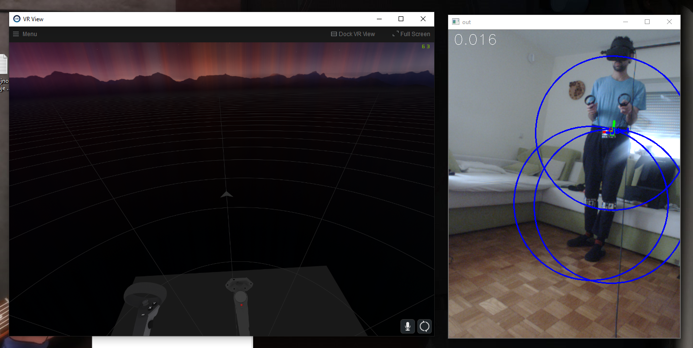

# April-Tag-VR-FullBody-Tracker
Full-body tracking in VR using AprilTag markers.

This is my second attemt at creating a full-body tracking system using fiducial markers. This should enable people to get fullbody tracking for free, using only a phone and some cardboard. It is possible to get pretty good tracking with trackers of sizes as small as 10cm and a PS eye camera of 640x480 resolution. Increasing the marker size or using a higher resolution and faster phone camera further improves tracking.

To use, you will have to make three trackers - one for each leg and one for hips. Using only leg trackers will not work in VRChat!

This version uses the much more accurate AprilTag system and includes many improvements to make the system easier to use, such as a GUI interface and a more straight forward calibration.

If you have any issues or encounter any bugs, feel free to open an issue on github or message me on discord: juice#6370

The program can be downloaded from the releases tab.


Beatsaber demo: https://youtu.be/Akps-dH0EeA

## Connecting a camera

The first step is connecting a camera feed to you computer. This step is probably the most complex, since you will have to find out what works best for you.
Each of the methods has its pros and cons, so try them out and see what works best. If you know of any other option, feel free to use that!

This tutorial only outlines the methods to connect a camera, and their pros and cons. If you have problems related to these, you should refer to their official tutorials. You should get it working before continuing with the tutorial.

### Using a USB webcam:

#### Pros:
* Simple to setup
* High quality cameras will offer good performance(1080p 60fps)

#### Cons:
* Most cameras have a too low resolution and too much motion blur to use effectively

If you have a USB camera, you should try that first. If tracking is too bad, you can always switch to a phone later. A ps3 eye camera will work, but just barely due to its low resolution.

#### Tutorial:

Connect the camera to your PC and you are done! If you use a PS3 eye camera, also install the PS3 eye universal driver.

### Using IP-Webcam wireless:

#### Pros:
* Fairly simple to setup
* Plenty of video options

#### Cons:
* Requires a good wifi connection
* Your PC and phone must be connected to the same network
* Only for android phones

If you have your PC and android phone connected to the same router and you have a strong wifi connection on your phone, this is the option you should use.

#### Tutorial:

Download the app IP Webcam from the play store. Start the app. Under video preferences->video resolution, select the resolution you wish to use. You should try to use a 4:3 aspect ratio with a resolution of around 800x600. Then, go back and click start server. Try to connect to your phone through your browser: click the help icon 
if you dont know how

### Using IP-Webcam wired:

#### Pros:
* Plenty of video options

#### Cons:
* A little harder to setup
* May not work on all phones and computers

If you dont have a good wifi connection, but have a half recent android phone, you should try this option. It may not work, however.

#### Tutorial:

For this we will use our phones network over USB feature. This is usualy used to share the phones network or wifi with a computer, but if we disable wifi and mobile network on our phone, we can also use it as a direct connection between our phone and PC. First disable wifi and mobile network. Then connect your phone to your PC with a USB cable. Now enable the internet over USB option on your phone. Now, you can follow the same instructions as for the wireless one!

NOTE: Make sure that your networks are disabled or this won't work!

### Using DroidCam OBS:

#### Pros:
* Should work on any device, including iphones
* Wired or wireless

#### Cons:
* Less video options than IP-Webcam
* Higher latency

If previous options dont work for you or you have an iphone, this is the option you should choose. It should work on any device, either wireless or wired.

#### Tutorial:

First, follow the DroidCam OBS official tutorial to get the phone-OBS connection. Use the 720p video resolution to ensure there is no watermark.
Then, follow the OBS VirtualCam plugin tutorial to stream to a virtual camera.
The phone will now act as a regular webcam.

## The trackers

### How the trackers work


This is a single Apriltag marker. Each marker has a white square in the middle that is used for detection and an unique pattern of black and white for identification. This means that a single marker must always be completely visible and completely flat in order to be detected.

A tracker is composed of multiple markers facing diffrent directions, which ensures that at least one marker is visible when rotating it. They must all be fixed together and none of the markers that are included in a tracker should move or bend seperately. Tracker 0 is composed of marker id 0 and any number of extra markers of ids 1-44, tracker 1 is marker id 45 and any number of markers 46-89 etc.

The simplest version of three trackers is the following: Tracker 0 made of marker 0 and 1, tracker 1 of marker 45 and 46 and tracker 3 of marker 90 and 91. To prevent bending, they are glued to cardboard. Each of them are glued together at an 90° angle. To make them yourselves, print the Apriltag.pdf file. Refer to the below photos to cut them out and glue them properly.


Cut along the red lines, bend along the blue lines. Print the image without the lines.


How the trackers should look like from the front


How the trackers should look like from the top


Close up of whats behind the leg trackers. Notice the small piece of cardboard for support against bending and the hooks for rubber bands.


Tracker 0 will be used on our hips, and, since the rubber bands will stretch it more, should use some additional supports. I used some wire, but you can rather just use more cardboard.

Add some way of fixing the trackers to your body. I use some hooks, through which i can then fix the trackers using rubber bands.

NOTE: Make sure the pattern on the trackers is clearly visible and is not obstructed! Ensure the markers bend as little as possible!

## Installing the SteamVR driver

Inside the driver_files folder, there is a apriltagtrackers folder. Copy this folder to "Steam/steamapps/common/SteamVR/drivers". Now, open "Steam/config/steamvr.vrsettings" and, under "steamvr", add the field ```"activateMultipleDrivers" : true,``` .

This will ensure that every time we launch steamvr, it will attempt to connect to the ApriltagTrackers program through our driver.

## Running Apriltag Trackers

You can now run Start_ApriltagTrackers.bat! The first time you launch it, you may see a black console window for a few seconds. Below is a quick guide on what the buttons and parameters do.

### Camera tab

This is the main tab of the program that you will use most of the time.

#### Start/Stop camera

Start the camera or stop it if its already running. This button will open the camera that you have written in the parameters tab. To ensure its working correctly, enable the Show preview checkbox.

If the camera fails to start, ensure that your camera is conencted and running, that you have written the correct id/address, and that you have saved the parameters after changing them. If you are using an USB webcam or OBS, try a diffrent id. You may also have to set the correct camera width/height in the parameters.

If the camera is of incorrect resolution/shrunk, refer to the camera width and height parameters.

#### Calibrate camera

This will start the camera calibration sequence. Turn off camera preview before starting. This must only be done the first time you use this program and if you change the camera you are using.

Two windows will open: one with a chessboard pattern, and one showing your camera feed. Every few seconds, the camera will take a picture. Move the camera around slowly, taking pictures of the chessboard pattern from as many diffrent angles as possible. Once 15 pictures are taken (progress is written on top left) the camera will calibrate. If you can, try to use an actual or printed chessboard instead of the one on the screen.

Sometimes, if the picture is too blurry or the lightning is bad, the chessboard pattern wont be detected. This will happen more often on an on-screen chessboard and shouldnt be a problem if you print it.


Using an wooden chessboard for calibration. If you use a screen, the chessboard may not be detected on every picture.

#### Calibrate trackers

This will start tracker calibration. Camera should be running and calibrated. Before starting, put on your trackers in the same way you will use them in game. You must only do this step on first launch and whenever you change the trackers.

Capture the trackers with the camera. To add a marker to the tracker, film it while another, already added marker is seen. A green marker means its already added, yellow means it is being added, and red means it cannot add it because no already added marker is seen. Repeat this process until all markers on the trackers are green.

If some of the markers only have a thin blue outline, it means the markers are detected, but do not belong to any of the used trackers. You have probably set a too low number of trackers in the parameters.


Example of tracker calibration. Rotate the trackers around a bit. The axis should follow nicely no matter the number of markers that are detected for the tracker.

#### Connect to SteamVR

When you press this button, the program will start waiting for steamVR to start. Start it from steam. If the connection will succeed, you will se the trackers on the status window, next to the hmd and controllers.


Place your camera somewhere somewhere around hip height. Make sure your camera will be in front of your SteamVR playpace. With Index and Vive, this should be towards your PC. With Oculus, this is the direction you were facing while calibrating your guardian. You can check the direction by going into SteamVR with SteamVR Home disabled - there will be a grey arrow on the ground indicating forward. Thats where your camera should be. (You do not have to be exact, however. It can easily be moved a meter or two to the side).



This is the arrow representing the forward of steamvr. When you face this direction, the camera should see your front.

If the trackers do not show up on the status window, check if you installed the driver correctly. Make sure you copied the folder into the correct place and that you added ActivateMultipleDrivers into the steamvr config.

#### Start

This button should be pressed from the virtual desktop in the SteamVR dashboard (don't use Oculus/WMR dashboard or you wont see the trackers!). It will start the program, and it will automatically be in calibration mode.

In the window, you can see the following things: The detected markers will have a green outline with their id written in blue. Around the markers, there will be blue circles: these represent the area that is searched during detection. If not all trackers are found, the entire vertical area is searched every second. You will see blue squares instead of circles when that happens. If you are in calibration mode, the calibration tracker will have a red-green-blue axis drawn to help calibration.

When in calibration mode, a tracker should appear in the center of your playspace, one meter from the ground. Align your calibration tracker (tracker 0 by default) with the seen controller. Rotate it so blue axis will face the camera, red will point right and green will point up. Then rotate it until your leg trackers will align correctly as well. Once the trackers are aligned, turn of the calibration mode with the check mark. The trackers should now be calibrated! If there is still an offset between the trackers in VR and real life, you can always check the calibration mode again and retry.


Short calibration demo. Use your controller to help position the tracker correctly.

If you cant see the trackers: First make sure that you have your SteamVR dashboard open. The trackers dont appear in games or SteamVR home. Second, sometimes, the tracker will not apear at the center of your playspace. Look around. If the tracker is somewhere else, refer to the calibration offset parameters.

If, during calibration, moving the tracker to the correct place means moving it outside of the view of the camera, refer to the calibration offset parameters.

If you can move the tracker to the correct position, but cant rotate it correctly (the tracker will rotate away from the camera and no longer be detected before the positions of leg trackers match), make sure that your camera is in front of your SteamVR playspace. (refer to the Connect to SteamVR part)

### Parameters

Below are short descriptions of the parameters you can set.

When changing parameters, make sure that you press save or they will not take effect! While some changes will work immediately after saving, you may need to restart tracking for others (press the Start button on the camera tab to stop, then press Start again to start. You do not need to recalibrate playpace after doing this).

#### Ip or ID of camera:

If you have a webcam or OBS, this value will be a number, usualy 0, 1, or more if you have more cameras connected. Best way to figure out the correct index of the camera is to try them: Type in 0, press save, go back to Camera tab, check preview camera and press Start/Stop camera. If the correct camera shows up, great, you can go to the next step! If not, repeat the process with 1, then 2 etc until you find it.

If you use IP Webcam, you should enter your IP address, the same one as you used in your browser but ending with /video. The field should look something like this: ```http://192.168.1.100:8080/video``` but with some diffrent numbers.

#### Number of trackers:

The number of trackers you wish to use. For full body, you have to use 3. You cannot use fullbody in VRchat with just 2!

#### Size of markers in cm:

Measure the size of your printed markers in cm, and input the value here. Measure the white square, like this:


#### Rotate camera 90°:

This will flip the camera view 90°. This will enable you to stand closer to the camera, which is usefull if you dont have much space or you have a low resolution camera (640x480). If you use a PS eye, you should use this.

#### Number of values for smoothing:

The algorithm uses a sliding window mean smoothing. This is the number of previous position values that will be used for the window. It ensures that tracking outliers are removed, but introduces some delay. 5 seems to be the best balance between delay and performance.

If you dont know what that means, just leave it at 5.

#### Additional smoothing:

While the sliding mean does some smoothing, it is usualy not enough to eliminate shaking. Aditional smoothing is done using a leaky integrator, with the formula: current_position = previous_position * value + tracked_position * (1-value).

What this means is that the parameter is between 0 and 1, 0 meaning only using tracking data without smoothing and 1 meaning using only previous data. Decreasing this parameter will increase the speed, but also increase shaking.

#### Quad decimate:

This is the quality setting. The value can either be 1, 1.5, 2, 3 or 4. The higher is this value, the faster will the tracking be, but the range will decrease. It is dependant on the camera you use. In general, you will probably have to use 1 on 480p, 2 on 720p and 3 on 1080p. You can fine tune this parameter later based on the performance you are getting. (If you get high FPS, you can decrease it. If your trackers dont get detected well, increase it.)

#### Search window:

To increase performance, the algorithm only searches for trackers in a window around the position they were last seen in. This parameter sets the size of the window. Lowering this value will make the windows smaller, which makes the program run faster, but increases the chance you move the tracker outside the window which will cause it to not get tracked anymore.

The window is visualized with blue circles/boxes, based on the parameters. The tracker must be inside at least one window or it will not be tracked.

#### Tracker to use for calibration:

The ID of the tracker that will be used for SteamVR playspace calibration. By default this is tracker 0, meaning the hip tracker.

#### Use previous position as guess:

This parameters sets if, when estimating the 3d position of a detected tracker, the algorithm should use the previous position as a guess to help it or not. Should ticked unless you know what you are doing.

#### X/Y/Z calibration offset:

This parameter sets the position, at which you have to calibrate the marker. It is in SteamVR coordinates. By default, this means the center of your playspace, one meter above ground. In some cases, this position will not be seen on the camera, and you will have to change it. (Usualy, lowering the Y axis (up/down) should be enough.)

Sometimes, however, the center of the playspace is nowhere near the actual center of your room. In that case, you will have to find where the tracker was put and try to move it to the center using this values. It might take some time to guess it correctly, but it will only have to be done once.

#### Use circular search window:

Search for trackers in a circular window around the previous known position or use vertical boxes. Since using circular windows is much faster, there is usualy no reason not to use them.

#### Camera FPS:

The FPS of your camera. If you want to use a 60fps camera, set this to 60.

#### Camera width/height:

You can usualy leave this on 0 and the program will automaticaly determine the correct width and height.

On some cameras, and usualy with OBS, the camera will be opened with the wrong resolution and aspect ratio. In that case, replace these values with the correct ones.

### Known issues:

* Sometimes an extra blue circle will appear, which may slow down detection as it causes a larger area to be searched than necessary. You can restart detection to fix this issue. (just press Start twice to stop and start again). This can be seen in the VRChat demo.
* A tracker may face the wrong direction if only one marker is seen. This can be seen in the Beatsaber demo video.

### TODO: 

* Tutorial for reducing camera exposure on IP-Webcam
* Virtual hip to enable use of leg trackers only
* Change the view model to vive pucks


